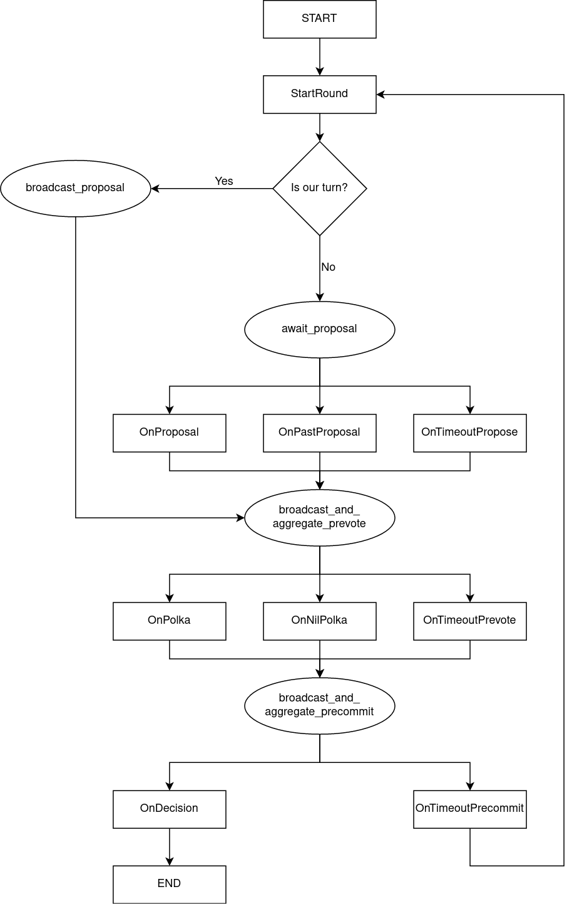

# Tendermint

Tendermint is a Rust library that implements the consensus algorithm of the same name. It follows the pseudo-code of
Tendermint's [original paper](https://arxiv.org/abs/1807.04938v3). The code only implements the high-level protocol.
All the network and block production/verification functionality has to be implemented separately. But a trait is
provided that describes the required functions.

## Implementation

This Tendermint implementation works like a state machine, moving from state to state until it either returns a
completed block or an error. It was necessary to do two modifications to the original protocol in order to be able to
refactor it from its original message passing form into the state machine form that we use:

1. For each round, we only accept the first proposal that we receive. Since Tendermint is designed to work even if the
proposer sends different proposals to each node, and the nodes don't rebroadcast the proposals they receive, we can
safely ignore any subsequent proposals that we receive after the first one.

2. The protocol assumes that we are always listening for proposals and precommit messages, and if we receive any
proposal with 2f+1 precommits accompanying it, we are supposed to accept it and terminate. We don't do this. Instead, we
assume that some other crate will be listening for completed blocks and will terminate Tendermint when it receives one.

Below you can find a flow diagram of Tendermint's state machine. The square boxes represent states and their
corresponding functions in protocol.rs (except for the start and end boxes, which are just indicative), the elliptic
boxes represent the network functions in network.rs.

## License

Licensed under Apache License, Version 2.0, ([LICENSE-APACHE](LICENSE-APACHE) or http://www.apache.org/licenses/LICENSE-2.0).

### Contribution

Unless you explicitly state otherwise, any contribution intentionally
submitted for inclusion in the work by you, as defined in the Apache-2.0
license, shall be licensed as above, without any additional terms or
conditions.