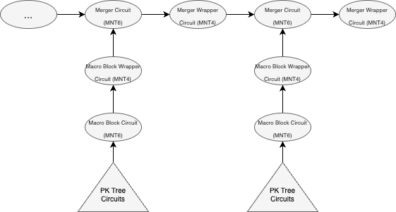
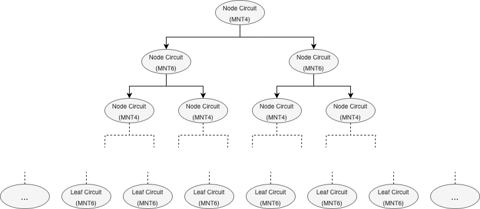
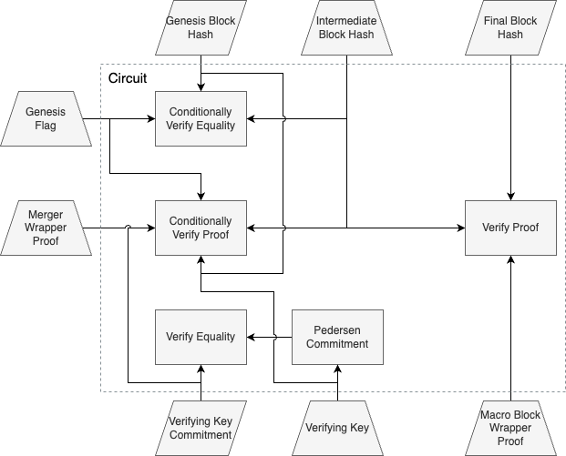

# Nimiq ZKP Circuits
This crate contains the zero-knowledge proof circuits for Nimiq's light client.
Together with the code in the `nimiq-zkp` and `nimiq-zkp-primitives` crates, it allows to recursively prove the state of the chain.

Our circuits are built on top of [arkworks](https://arkworks.rs).
We perform Groth16 SNARK proofs on the MNT4/6 elliptic curve cycle (specifically the MNT4-753 and MNT6-753 curves).
We can use the MNT4 curve to prove statements in the MNT6 curve and vice-versa (you can find an in-depth introduction to recursive SNARKs [here](https://www.michaelstraka.com/posts/recursivesnarks/)).

More detailed information on Nimiq's blockchain protocol can be found [here](https://arxiv.org/abs/1903.01589).

## Crate Structure
This crate is structured as follows:

- `gadgets`: Gadgets are smaller building blocks containing intermediate computations that can be composed to build a more complete statement. This folder contains curve-independent gadgets, while curve-specific gadgets are placed in the corresponding subfolders.
- `circuits`: Contains the ZKP circuits (more details below). A circuit may combine multiple gadgets to prove a larger statement. Our circuits are always specific to a curve.

Each of these folders contains two folders `mnt4` and `mnt6` for curve-specific code.
Note that this refers to the curve the statements are made in and not the curve the proof will be generated with.
A circuit in the `mnt6` folder, for example, will contain statements on the MNT6-753 curve.
We will prove these statements using Groth16 over MNT4-753.

## Circuits
At a very high level, we use recursive SNARKs to compress the work of verifying many blocks into a single short proof.
Our setup also allows us to update a proof when a new block comes in, without having knowledge of the past blocks.
We only need the previous proof and the new block.

This library consists of several circuits that, when chained together, can recursively prove the validity of many blocks.
The image below illustrates that: 

The arrows represent that the proof generated by one circuit is given as input to another circuit.
The given curve indicates in which folder it can be found.
A brief description of each circuit:

* __Macro Block Circuit__: This circuit verifies the validity of a single block.
* __Macro Block Wrapper Circuit__: This circuit verifies a SNARK proof of the Macro Block circuit. It is used to _wrap_ the Macro Block proof so that it can be fed into the Merger circuit.
* __Merger Circuit__: This circuit verifies two SNARK proofs. It is used to _merge_ two different proofs into a single one.
* __Merger Wrapper Circuit__: This circuit verifies a SNARK proof of the Merger circuit. It is used to _wrap_ the Merger proof so that it can be fed into the Merger circuit.

Note that Groth16 is only used with the MNT6 curve for the wrapper circuits (statements on MNT4).
We do this because the MNT6 curve is less efficient for proving and cannot handle large circuits, so we use it only with the smallest circuits.

### Macro Block Circuit
The macro block circuit attests that there exists a block that causes a valid state transition. Since there are 512 slots in a block, it isn't possible to process all of their public keys inside a single circuit.
So the macro block circuit outsources the aggregation of the public keys to a tree of recursive SNARK circuits, that we call the PK Tree, which we will explore later.

The macro block circuit takes as public inputs the previous header hash and the header hash of this block.

The macro block circuit takes as private inputs:

* The previous macro block, which most importantly contains the root over a Merkle tree of the public keys of the validators for the following epoch. It also contains all other information to verify the hash of the block.
* The macro block to be proven, which includes the signature and signer bitmap. Again, it contains all information required to verify the hash of the block.
* The aggregate public key for the block signature. It is calculated by adding the public keys of all the validators that signed the block. It is actually given as "chunks", which are simply the aggregate public keys for a subset of the  validators (for this specific case we have two chunks, one for each half of the validator list). This "chunking" is done so that it can be inputted into the PK Tree circuit.
* A SNARK proof for the PK Tree circuit. This proof verifies that the aggregate public key provided as a private input, is correctly calculated from the list of validator public keys and the signer bitmap.

The macro block circuit performs the following actions:

1. Enforce that `prev_block.block_number + epoch_length == final_block.block_number`.
2. Enforce that the calculated hash of the previous block equals the previous block hash given as public input. The block hash is used as a commitment to its contents.
3. Enforce that the calculated hash of the final block equals the final block hash given as public input. The block hash is used as a commitment to its contents.
4. Calculate the root hash over the two chunks for the PK Tree circuit and enforce equality with the PK Tree root hash in the previous block: `blake2s(left_hash || right_hash) == prev_block.pk_tree_root`
5. Verify PK Tree circuit proof with the chunks (and its hashes) and the signer bitmap from the final block as input.
6. Calculate the aggregate public key from its chunks and verify the signature on the final block.

### PK Tree Circuits
The purpose of the PK Tree is to check that the aggregate public key given as a private input in the macro block circuit is correct. The actual calculation is quite simple, we simply add the public keys of all the validators that signed the block, which can be checked easily using the signer bitmap. The problem is that a circuit that processes all the 512 public keys would be too large and would be impossible to run in a normal computer. So we divide the aggregation into 32 parts (16 keys per part) and then have 5 levels of circuits that merge the 32 proofs into a single one. In the end it forms a tree:

 

### Wrapper Circuits
The wrapper circuits, both for the macro block and for the merger, attest that there is SNARK proof for the circuit that they are wrapping.

They have the same public inputs as the circuit that they are wrapping. But they have a single private input, the SNARK proof for the circuit that they are wrapping.

### Merger Circuit
The merger circuit attests that there are two SNARK proofs that prove the existence of two valid state transitions, first from the initial state to an intermediate state and then from that intermediate state to the final state.
In practical terms, it verifies one proof from the Macro Block Wrapper circuit and one proof from the Merger Wrapper circuit.

This circuit takes as public inputs the genesis block hash, a final block hash and a verifying key commitment.
The verifying key commitment is a commitment to the verifying key of the Merger Wrapper circuit.
This commitment is necessary because unfortunately the Merger Wrapper verifying key cannot be embedded as a constant like the verifying keys for the other circuits.

As private inputs the Merger circuit takes:
* The SNARK proofs for the Merger Wrapper and Macro Block Wrapper circuits.
* The verifying key for the Merger Wrapper. This will be checked against the verifying key commitment given as public input.
* An intermediate block hash. If the initial state is _0_ and the final state is _N_, then the intermediate state should be _N-1_.
* The genesis flag. This is a boolean flag that is meant to indicate if a given instance of the merger circuit is verifying the fist epoch. Note that if we are verifying the first epoch, then this is the first Merger circuit in the SNARK chain and there is no Merger Wrapper proof to verify. If this flag is set to true then the circuit will not verify the SNARK proof for the Merger Wrapper, but it will enforce that the initial state and the intermediate state must be equal. If the flag is set to false then the reverse will happen.

The following image shows the details of the merger circuit:

## License
Licensed under Apache License, Version 2.0, (http://www.apache.org/licenses/LICENSE-2.0).

### Contribution
Unless you explicitly state otherwise, any contribution intentionally submitted for inclusion in the work by you, as
defined in the Apache-2.0 license, shall be dual licensed as above, without any additional terms or conditions.