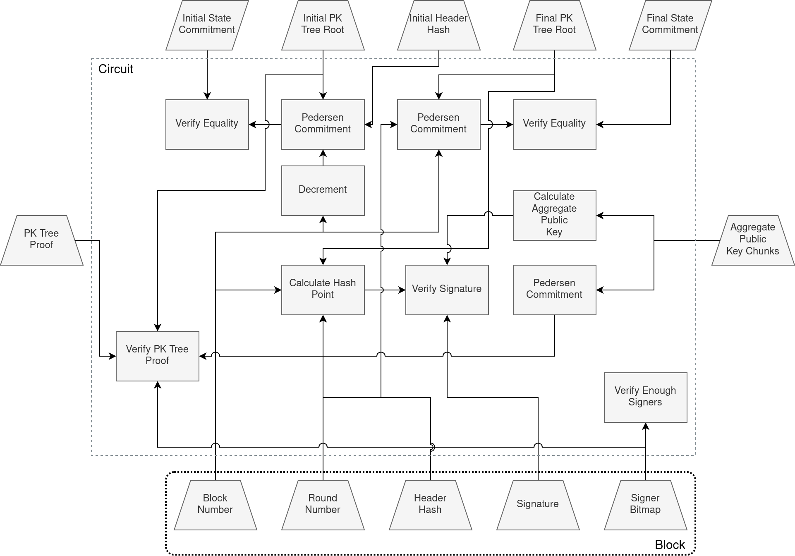
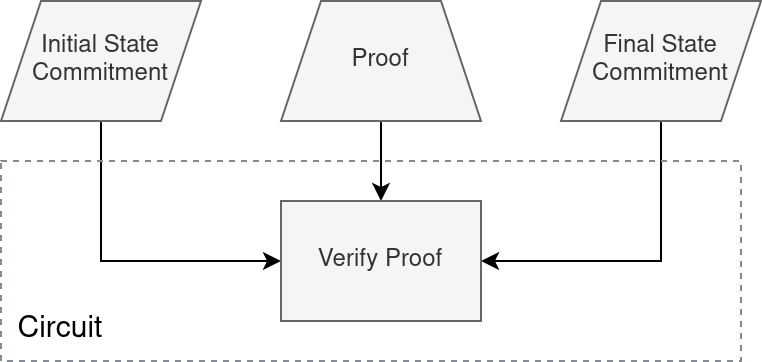

# Nano ZKP
Nano ZKP is a library that implements the zero knowledge proof part of Nimiq's Nano Sync.
Specifically, it contains code that allows one to generate parameters, create proofs and verify proofs for several circuits
that together create a chain of proofs that can be used to recursively prove the entire header chain starting at the
Genesis block.

## Circuits
At a very high level, we use Recursive SNARKs to compress the work of verifying many blocks into a single short proof. Our
setup also allows us to update a proof when a new block comes in, without having knowledge of the past blocks. We only need
the previous proof and the new block.

We perform SNARK proofs on the MNT4/6 elliptic curve cycle (specifically the MNT4-753 and MNT6-753 curves). We
can use the MNT4 curve to prove statements in the MNT6 curve and vice-versa (you can find an in-depth introduction to
recursive SNARKs [here](https://www.michaelstraka.com/posts/recursivesnarks/)).

This library consists of several circuits that, when chained together, can recursively prove the validity of many blocks.
The image below illustrates that: 

The arrows represent that the proof generated by one circuit is given as input to another circuit. A brief description of
each circuit:

* __Macro Block Circuit__: This circuit verifies the validity of a single block.
* __Macro Block Wrapper Circuit__: This circuit verifies a SNARK proof of the Macro Block circuit. It is used
to _wrap_ the Macro Block proof into the MNT6 curve so that it can be fed into the Merger circuit.
* __Merger Circuit__: This circuit verifies two SNARK proofs. It is used to _merge_ two different proofs into a single one.
* __Merger Wrapper Circuit__: This circuit verifies a SNARK proof of the Merger circuit. It is used
to _wrap_ the Merger proof into the MNT6 curve so that it can be fed into the Merger circuit.

Note that the MNT6 curve is only used for the wrapper circuits. We do this because the MNT6 curve is less efficient and 
can't handle large circuits, so we use it only with the smallest circuits.

### Macro Block Circuit
The macro block circuit attests that there exists a block that causes a valid state transition. Since there are 512
validators in a block, it isn't possible to process all of their public keys inside a single circuit. So the macro block
circuit outsources the aggregation of the public keys to a tree of recursive SNARK circuits, that we call the PK Tree,
which we will explore later.

The macro block circuit takes as public inputs an initial state commitment and a final state commitment. The state commitment
is a commitment to the block number, the header hash and to the public keys of the validators that were selected in that block.
To compute it first we calculate the root of a Merkle tree over the public keys, then we serialize the root, the header hash
and the block number. To finish, we create a Pedersen commitment from the serialization.

The macro block circuit takes as private inputs:

* The macro block, which itself consists of the block number, the round number (used in the Tendermint protocol), the hash of
  block header, the signature and the signer's bitmap.
* The roots of the Merkle trees over the public keys (which we will call the PK trees) of the initial and final states.
* The aggregate public key for the block signature. It is calculated by adding the public keys of all the validators that
  signed the block. It is actually given as "chunks", which are simply the aggregate public keys for a subset of the
  validators (for this specific case it's two chunks, one for each half of the validator list). This "chunking" is done
  so that it can be inputted into the PK Tree circuit.
* A SNARK proof for the PK Tree circuit. This proof verifies that the aggregate public key provided as a private input,
  is correctly calculated from the list of validator public keys and the signer bitmap.

The following image illustrates the inner workings of the macro block circuit. Notice that the public and private inputs
have different shapes in the diagram.

### PK Tree Circuits
The purpose of the PK Tree is to check that the aggregate public key given as a private input in the macro block circuit
is correct. The actual calculation is quite simple, we simply add the public keys of all the validators that signed the
block, which can be checked easily using the signer bitmap. The problem is that a circuit that processes all the 512
public keys would be too large and would be impossible to run in a normal computer. So we divide the aggregation into
32 parts (16 keys per part) and then have 5 levels of circuits that merge the 32 proofs into a single one. In the end
it forms a tree:

 

### Wrapper Circuits
The wrapper circuits, both for the macro block and for the merger, attest that there is SNARK proof for the circuit that
they are wrapping.

They have the same public inputs as the circuit that they are wrapping. But they have a single private input, the SNARK
proof for the circuit that they are wrapping.

As an example, the following image shows the macro block wrapper circuit:

### Merger Circuit
The merger circuit attests that there are two SNARK proofs that prove the existence of two valid state transitions, first
from the initial state to an intermediate state and then from that intermediate state to the final state. In practical terms,
it verifies one proof from the Macro Block Wrapper circuit and one proof from the Merger Wrapper circuit.

This circuit takes as public inputs an initial state commitment, a final state commitment and a verifying key commitment.
The state commitments were already explained in the Macro Block circuit section. The verifying key commitment is a commitment
to the verifying key of the Merger Wrapper circuit. This commitment is needed because unfortunately the Merger Wrapper
verifying key cannot be hard-coded as a constant like the verifying keys for the other circuits.

As private inputs the Merger circuit takes:
* The SNARK proofs for the Merger Wrapper and Macro Block Wrapper circuits.
* The verifying key for the Merger Wrapper. This will be checked against the verifying key commitment given as public input.
* An intermediate state commitment. If the initial state is _0_ and the final state is _N_, then the intermediate state
should be _N-1_.
* The genesis flag. This is a boolean flag that is meant to indicate if a given instance of the merger circuit is verifying
the fist epoch. Note that if we are verifying the first epoch, then this is the first Merger circuit in the SNARK chain
and there is no Merger Wrapper proof to verify. If this flag is set to true then the circuit will not verify the SNARK
proof for the Merger Wrapper, but it will enforce that the initial state and the intermediate state must be equal. If the
flag is set to false then the reverse will happen.

The following image shows the details of the merger circuit:

## License
Licensed under Apache License, Version 2.0, (http://www.apache.org/licenses/LICENSE-2.0).

### Contribution
Unless you explicitly state otherwise, any contribution intentionally submitted for inclusion in the work by you, as
defined in the Apache-2.0 license, shall be dual licensed as above, without any additional terms or conditions.